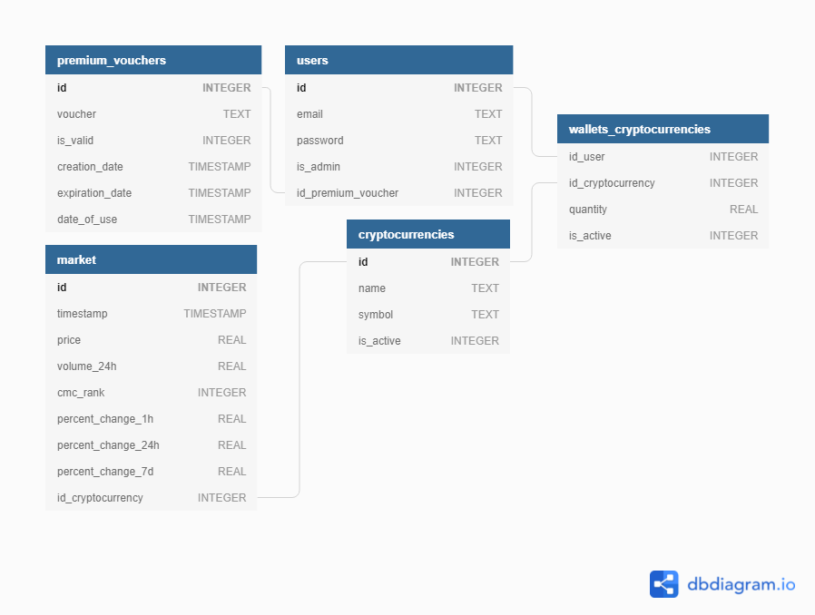

# Description du projet

L'application mobile Avenir a pour objectif de fournir à ses utilisateurs un moyen simple de suivre leurs investissements en cryptomonnaies comme le Bitcoin, l'Ethereum ou encore le Litecoin.

* Avenir permet de **tenir gratuitement un portefeuille personnel** composé de vos cryptommonaies (à ajouter manuellement pour plus de flexibilité) ainsi que de **suivre vos performances en direct**.
* Avenir permet également de **suivre en temps réel les données du marché***.

(*) : fonctionnalité réservée aux utilisateurs premium.

Projet CAW, Ensimag, 2021.  

# Cas d'usage


# Maquette / les différents écrans


# Modèle de données



# API back-end

TODO

# Choix techniques

## Webservices utilisés

L'application Avenir utilise pour le moment l'**API de CoinMarketCap** sur le plan le plus basique, soit avec une clé gratuite.  
Les limitations actuelles sont donc les suivantes :
* 9 endpoints disponibles sur les 22 existants
* 10.000 appels API par mois maximum
* Aucune historisation des appels
* Utilisation non commerciale

De par l'objectif d'évolution de l'application Avenir et de l'arrivé de notre future boutique de vente de coupons premium très prochainement, il est prévu, dans un futur proche, d'investir dans un abonnement permettant de passer outre les contraintes citées ci-dessus.

Les fonctions appelant l'**API de CoinMarketCap** se situent exclusivement au sein du fichier **avenir/services/coinMarket.js**.
Celles-ci s'occupent principalement de récupérer les différentes données du marché (nom des cryptomonnaies, leur symbole, leur prix actuel, le volume des transactions sur 24h, le % d'évolution du prix sur les derières heures...) à intervalle régulier.

## Gestion des rôles

Au sein de l'application, il y a 4 rôles différents :
* **Utilisateur non authentifié** : il s'agit du rôle par défaut au lancement de l'application sans être connecté.
* **Utilisateur authentifié** : il s'agit du rôle par défaut une fois connecté.
* **Utilisateur premium authentifié** : ce rôle est attribué à un utilisateur authentifié, une fois que celui-ci a entré un coupon premium valide au sein du panel utilisateur (écran "Profil").
* **Administrateur** : ce rôle doit être attribué manuellement via la base de données.

La gestion des rôles s'effectue grâce à la table "users" :
* **Utilisateur authentifié** : user avec is_admin à 0 et id_premium_voucher à NULL.
* **Utilisateur premium authentifié** : user avec is_admin à 0 et un id_premium_voucher correspondant à un premium_voucher valide.
* **Administrateur** : user avec is_admin à 1.

Pour plus de précisions, se référer à la section "Cas d'usage", "Maquette" et/ou "Modèle de données" ci-dessus.

## Structure projet


# Screencast

TODO

# Back-end

## Lancer le serveur

Ouvrir un terminal et saisir :

```sh
$ git clone https://gitlab.ensimag.fr/pintodaj/avenir # or clone your own fork
$ cd avenir
$ npm install
$ npm start
```

Le back-end de l'application devrait maintenant être lancé sur [localhost:5000](http://localhost:5000/).

# Front-end

## Lancer l'application

Ouvrir un premier terminal et saisir :

```sh
$ cd avenir/ui
$ npm install
$ npm start
```

Ouvrir un second terminal et saisir :

```sh
$ cd avenir/ui
$ npm run android # or "npm run ios" for ios
```

L'application devrait maintenant être lancée sur votre émulateur/appareil.

## Lint

Ouvrir un terminal et saisir :

```sh
$ cd avenir/ui
$ npm run lint
```

# Tests

TODO

