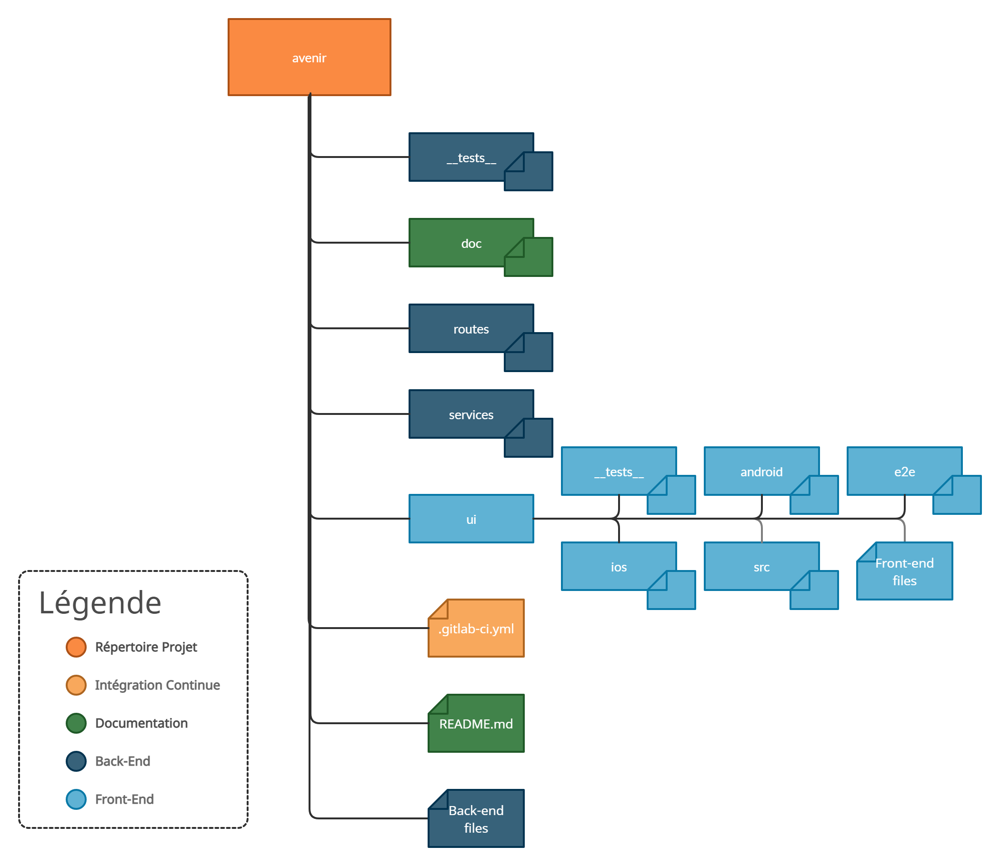

# Description du projet

L'application mobile Avenir a pour objectif de fournir à ses utilisateurs un moyen simple de suivre leurs investissements en cryptomonnaies comme le Bitcoin, l'Ethereum ou encore le Litecoin.

* Avenir permet de **tenir gratuitement un portefeuille personnel** composé de vos cryptommonaies (à ajouter manuellement pour plus de flexibilité) ainsi que de **suivre vos performances en direct**.
* Avenir permet également de **suivre en temps réel les données du marché***.

(*) : fonctionnalité réservée aux utilisateurs premium.

Projet CAW, Ensimag, 2021.  

# Cas d'usage


# Diagrammes de séquence

## Se connecter


## S'inscrire


# Maquette


# Modèle de données


# API back-end

| Path | GET | POST | PUT | DELETE |
| --- | --- | --- | --- | --- |
| /account/login | CR 405 | Permet de soumettre son email et son mot de passe pour se connecter.<br />CR 202 ou 403 | CR 405 | CR 405 |
| /account/registration | CR 405 | Créé un nouvel utilisateur en envoyant trois variables : email, password1, password2.<br />CR 201 ou 400 | CR 405 | CR 405 |
| /api/cryptocurrency | Donne toutes les données du marché de toutes les cryptomonnaies.<br />CR 200 | CR 405 | CR 405 | CR 405 |
| /api/cryptocurrency/id | Donne la description d&#39;une cryptomonnaie dont l&#39;ID est ID.<br />CR 200 | CR 405 | CR 405 | CR 405 |
| /api/wallet | Donne la description du portefeuille de l&#39;utilisateur en fonction du token de connexion.<br />CR 200 | CR 405 | CR 405 | CR 405 |
| /api/wallet/symbols | Donne la description de toutes les cryptomonnaies.<br />CR 200 | CR 405 | CR 405 | CR 405 |
| /api/wallet/id/amount | CR 405 | Créé une cryptomonnaie dont l&#39;ID est id et le montant est amount dans le portefeuille de l&#39;utilisateur.<br />CR 201 ou 400 | CR 405 | CR 405 |
| /api/wallet/id | CR 405 | CR 405 | Modifie le montant de la cryptomonnaie du portefeuille de l&#39;utilisateur. Le montant est renseigné par la variable amount.<br />CR 200 ou 400 | Supprime la cryptomonnaie dont l&#39;ID est id du portefeuille de l&#39;utilisateur.<br />CR 200 |
| /api/profile | Donne la description du profil de l&#39;utilisateur.<br />CR 200 | Ajoute un coupon premium pour l&#39;utilisateur dont le code coupon est renseigné dans la variable voucher.<br />CR 200 ou 400 | Modifie le mot de passe de l&#39;utilisateur renseigné dans les variables password1 et password2.<br />CR 200 ou 400 | CR 405 |
| /api/admin | Donne la description complète de toutes les cryptomonnaies de l&#39;API externe coinmarket.<br />CR 200 | CR 405 | CR 405 | CR 405 |
| /api/admin/symbols | Donne la description complète de toutes les cryptomonnaies.<br />CR 200 | CR 405 | CR 405 | CR 405 |
| /api/admin/id/name/symbol | CR 405 | Ajoute une cryptomonnaie dans notre API en renseignant l&#39;ID, son nom et son symbole.<br />CR 201 ou 400 | CR 405 | CR 405 |
| /api/admin/id/active | CR 405 | CR 405 | Modifie la visibilité de la cryptomonnaie dont l&#39;ID est id.<br />CR 200 ou 400 | CR 405 |

# Choix techniques

## Webservices utilisés

L'application Avenir utilise pour le moment l'**API de CoinMarketCap** sur le plan le plus basique, soit avec une clé gratuite.

Les limitations actuelles sont donc les suivantes :
* 9 endpoints disponibles sur les 22 existants
* 10.000 appels API par mois maximum
* Aucune historisation des appels
* Utilisation non commerciale

De par l'objectif d'évolution de l'application Avenir et de l'arrivé de notre future boutique de vente de coupons premium très prochainement, il est cependant prévu, dans un futur proche, d'investir dans un abonnement permettant de passer outre les contraintes citées ci-dessus.

Les fonctions appelant l'**API de CoinMarketCap** se situent exclusivement au sein du fichier **avenir/services/coinMarket.js**.
Celles-ci s'occupent principalement de récupérer les différentes données du marché (nom des cryptomonnaies, leur symbole, leur prix actuel, le volume des transactions sur 24h, le % d'évolution du prix sur les derières heures...) à intervalle régulier.

En effet, au sein du fichier **avenir/App.js** se trouve un appel à **coinMarketService.selectCryptocurrencies()**, qui s'effectue toutes les **coinMarketService.CALL_TIMER** millisecondes.  
**CALL_TIMER** étant une constante égale à **60000** millisecondes, cela équivaut à un intervalle d'une minute.  

La fonction **selectCryptocurrencies()** va ensuite appeler de façon asynchrone **insertCryptocurrenciesMarket(cryptocurrenciesSelected)**, fonction communiquant avec l'**API de CoinMarketBase** pour obtenir les dernières données disponibles concernant les cryptommonaies actives au sein de notre application.

## Gestion des rôles

Au sein de l'application, il y a 4 rôles différents :
* **Utilisateur non authentifié** : il s'agit du rôle par défaut au lancement de l'application sans être connecté.
* **Utilisateur authentifié** : il s'agit du rôle par défaut une fois connecté.
* **Utilisateur premium authentifié** : ce rôle est attribué à un utilisateur authentifié, une fois que celui-ci a entré un coupon premium valide au sein du panel utilisateur (écran "Profil").
* **Administrateur** : ce rôle doit être attribué manuellement via la base de données.

La gestion des rôles s'effectue grâce à la table "users" :
* **Utilisateur authentifié** : user avec is_admin à 0 et id_premium_voucher à NULL.
* **Utilisateur premium authentifié** : user avec is_admin à 0 et un id_premium_voucher correspondant à un premium_voucher valide.
* **Administrateur** : user avec is_admin à 1.

Pour plus de précisions, se référer à la section "Cas d'usage", "Maquette" et/ou "Modèle de données" ci-dessus.

## Structure projet



# Screencast

TODO

# Back-end

## Lancer le serveur

Ouvrir un terminal, et saisir :

```sh
$ git clone https://gitlab.ensimag.fr/pintodaj/avenir # or clone your own fork
$ cd avenir
$ npm install
$ npm start
```

Le back-end de l'application devrait maintenant être lancé sur [localhost:5000](http://localhost:5000/).

## Tests

Dans un terminal, saisir :

```sh
$ cd avenir
$ npm run test # or "npm run testWindows" for windows
```

---

Dernière analyse de couverture de code (07/06/2021) :


## Lint

Dans un terminal, saisir :

```sh
$ cd avenir
$ npm run lint
```

Le rapport listant les éventuels problèmes devrait maintenant apparaître dans le terminal.

Note : la règle "camelcase" a été désactivée au sein du fichier avenir/.eslintrc.js.

# Front-end

## Lancer l'application

Ouvrir un premier terminal, et saisir :

```sh
$ cd avenir/ui
$ npm install
$ npm start
```

Ouvrir un second terminal (en gardant le précédent ouvert), et saisir :

```sh
$ cd avenir/ui
$ npm run android # or "npm run ios" for ios
```

L'application devrait maintenant être lancée sur votre émulateur/appareil.

## Tests

Pour les tests Jest, dans un terminal, saisir :

```sh
$ cd avenir
$ npm run test
```

Pour les tests Detox, saisir :

```sh
$ cd avenir
$ avdmanager create avd -n pixel3A -d 23  -k "system-images;android-28;default;x86_64"
$ npm run test-detox
```

## Lint

Dans un terminal, saisir :

```sh
$ cd avenir/ui
$ npm run lint
```

Le rapport listant les éventuels problèmes devrait maintenant apparaître dans le terminal.

Note : la règle "react-native/no-inline-styles" a été désactivée au sein du fichier avenir/ui/.eslintrc.js.
